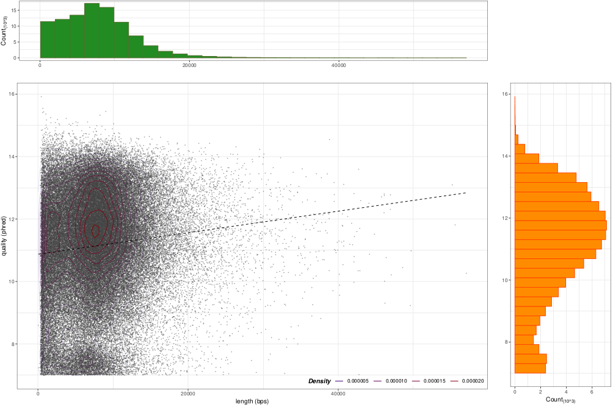

# NanoR


NanoR is a package for the statistical language and environment R, tested on Unix, MacOSX and Windows, that allows user-friendly analysis and comparison of 1D MinION and GridION X5 sequencing data within acceptable time frames.

NanoR on bioRxiv: 'NanoR: An user-friendly R package to analyze and compare nanopore sequencing data' (doi: https://doi.org/10.1101/514232).

NanoR is submitted to a scientific journal.

## Background

NanoR was developed under R 3.1.3 and tested on Unix, MacOSX and Windows using:

- MinKNOW-basecalled MinION .fast5 data obtained using R9.4 and R9.5 MinION Flow Cells
- Albacore-basecalled MinION .fast5 data obtained using R9.4 and R9.5 MinION Flow Cells
- Sequencing summary .txt and .fastq files returned by GridION X5 using R9.4 MinION Flow Cells
- Albacore-basecalled GridION X5 .fast5 data obtained from GridION X5 using R9.4 MinION Flow Cells

NanoR depends on the following R packages:

- ggplot2 (v 2.2.1)
- reshape2 (v 1.4.3)
- RColorBrewer (v 1.1.2)
- scales (v 0.5.0)
- seqinr (v 3.4.5)
- gridExtra (v 2.3)
- rhdf5 (v 2.14)
- ShortRead (v 1.24.0)
- parallel (v 3.1.3)
- grid (v 3.1.3)

If you don't have these packages in your R library, you have to download and install them before intalling NanoR, as specified below.


In order to install the needed packages, you can copy, paste and run the following lines in your R console:


```R

install.packages(c("ggplot2","reshape2","RColorBrewer","scales","seqinr","gridExtra"), repos= "http://cran.cnr.berkeley.edu/")
 
source("http://bioconductor.org/biocLite.R")

biocLite("rhdf5",suppressUpdates=TRUE, suppressAutoUpdate=TRUE)

biocLite("ShortRead",suppressUpdates=TRUE, suppressAutoUpdate=TRUE)

```
As rhdf5 version 2.14 (or higher) is needed, if biocLite does not automatically download this version, you can download it manually from bioconductor (http://bioconductor.org/packages/3.2/bioc/src/contrib/rhdf5_2.14.0.tar.gz) and install in R running from your R console:

```R

install.packages("/Path/To/rhdf5_2.14.0.tar.gz", repos=NULL)

```


Packages "parallel" and "grid" are "base packages" (they are usually present in your package list) but, if you don't find them in your available packages, quit R and add this line to your .Rprofile (or Rprofile.site) file:

```sh

options(defaultPackages=c(getOption("defaultPackages"),"parallel","grid"))

```

After that, save your new .Rprofile (or Rprofile.site) file and re-run R.
In order to install NanoR, you have to download the .tar.gz file from this repository using git:

```sh

git clone https://github.com/davidebolo1993/NanoR.git

```

If you have any issues with this command, try:

```sh

git clone git://github.com/davidebolo1993/NanoR.git

```

The previous command will clone in your folder the last release of NanoR (current, NanoR v1.0): check the releases to download R .tar.gz for previous versions. 


Then, from your R console:

```R

install.packages("/Path/To/NanoR.tar.gz", repos=NULL)

```

If you're using NanoR on Windows, be sure to specify paths using the following format, in order to avoid problems with "escape characters":

_"C:\\\Path\\\To\\\Data"_

Use NanoR on the complete set of .fast5 files you obtain from Nanopore MinION/GridION X5 in order to obtain significant statistics. A MinION and GridION X5 sample dataset on which NanoR can be tested is available to be downloaded at _https://faspex.embl.de/aspera/faspex/external_deliveries/611?passcode=6f668c8921cea5cc30d0a6c17ec228f6ba75936c&expiration=MjAxOS0wMi0yMlQxMDo1Njo0OVo=_


## Workflow examples

You can access all the informations on how to run functions from NanoR within R, using the following commands:

MinION data analysis

```R

?NanoPrepareM

?NanoTableM

?NanoStatsM

?NanoFastqM

```

GridION X5 data analysis

```R

?NanoPrepareG

?NanoTableG

?NanoStatsG

?NanoFastqG

?FastqFilterG

```

Comparison between experiments

```R

?NanoCompare

```


Here is an example of how to run the aforementioned commands:


### MinION data analysis

```R


List<-NanoPrepareM(DataPass="/Path/To/PassedFast5Files",DataFail=NA,DataSkip=NA,Label="Exp") # prepare data

Table<-NanoTableM(NanoPrepareMList=List,DataOut="/Path/To/DataOut",Cores=6,GCC=TRUE) # extract metadata. You can set "GCC" parameter to FALSE to skip GC content computation.

NanoStatsM(NanoPrepareMList=List,NanoMTable=Table,DataOut="/Path/To/DataOut") # plot statistics

NanoFastqM(DataPass="/Path/To/PassedFast5Files",DataOut="/Path/To/DataOut",Label="Exp",Cores=6,FASTA=FALSE) # extract .fastq but, in this case, not .fasta information from .fast5 files. You can set "FASTA" parameter to TRUE.

```

If working with folders containing passed, failed and skipped .fast5 files together, give this folder to the "DataPass" parameter of NanoPrepareM and NanoFastqM: NanoR will automatically filter out the low-quality sequences


### GridION X5 data analysis (if working with sequencing summary and .fastq files)

```R

List<-NanoPrepareG(BasecalledFast5=FALSE,Data="/data/basecalled/ExperimentName/FlowCellId",DataSkip="/data/reads/[FlowCellId]/[ExperimentId]/fast5/",Cores=6, Label="Exp") # prepare data. Dataskip can be omitted

Table<-NanoTableG(NanoPrepareGList=List,DataOut="/Path/To/DataOut",GCC=TRUE) # extract metadata: if encounter problems with GC content, set GCC to FALSE

NanoStatsG(NanoPrepareGList=List,NanoGTable=Table,DataOut="Path/To/DataOut") #plot statistics

FastqFilterG(Data="/data/basecalled/ExperimentName/FlowCellId",DataOut="/Path/To/DataOut",FASTQTOT=FALSE,FASTA=TRUE,Cores=6,Label="Exp") # filter .fastq files. You can return a concatenated .fastq file too setting the "FASTQTOT" parameter to TRUE

```


### GridION X5 data analysis (if working with basecalled .fast5 files)

```R

List<-NanoPrepareG(BasecalledFast5=TRUE,Data="/Path/To/PassedFast5Files",DataFail="/Path/To/FailedFast5Files", Label="Exp") # prepare data; data fail can be omitted

Table<-NanoTableG(NanoPrepareGList=List,DataOut="/Path/To/DataOut",Cores=10,GCC=TRUE) #extract metadata

NanoStatsG(NanoPrepareGList=List,NanoGTable=Table,DataOut="/Path/To/DataOut") # plot statistics

NanoFastqG(DataPass="/Path/To/PassedFast5Files",DataOut="/Path/To/DataOut",Label="Exp",Cores=10,FASTA=TRUE) #extract .fastq and .fasta
```

Some of the plots generated by NanoR for MinION and GridION X5 data analysis are shown below: you can access all the plots generated by NanoR in the Plots folder of this repository

**Reads number, basepairs number, reads length and reads quality for every 30 minutes of experimental run**


**Reads length vs reads quality**



**Channels and muxes activity**


**Passed and failed/skipped reads, GC content**


### Compare MinION/GridION X5 data

```R

DataIn<-c("Path/To/AnalyzedFolder1","Path/To/AnalyzedFolder2","Path/To/AnalyzedFolder3",...) #path to the NanoR-analyzed data

Labels<-c("Label1","Label2","Label3") #labels used

NanoCompare(DataIn=DataIn,DataOut="Path/To/DataOut",Labels=Labels,GCC=TRUE) #compare

```

One of the 2 plots generated by NanoR for MinION/GridION X5 data comparison is shown below: you can access all the plots generated by NanoR in the Plot folder of this repository


